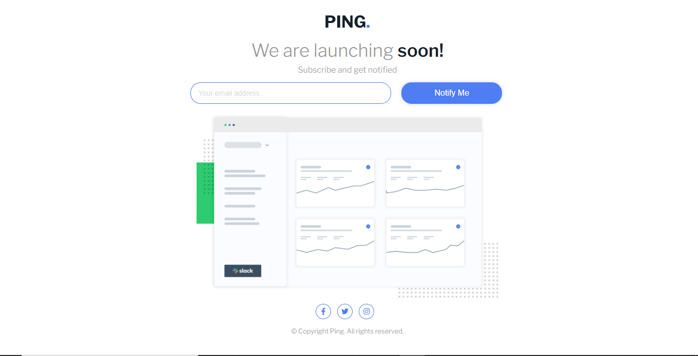
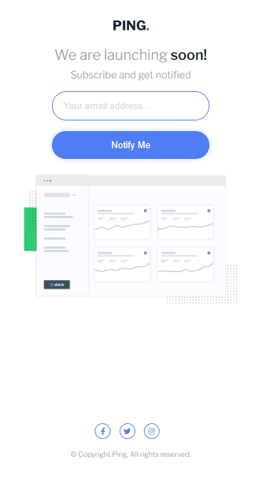
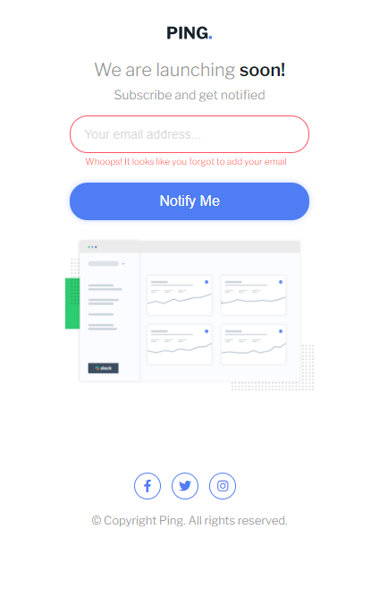
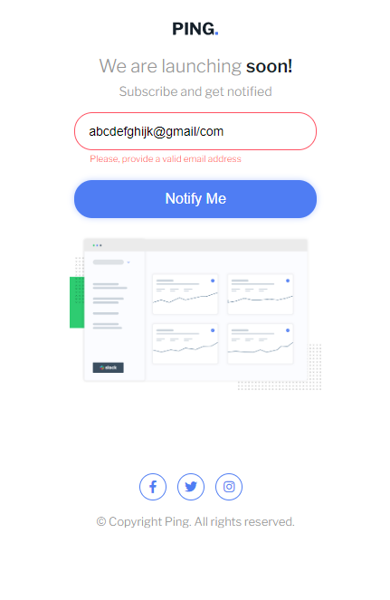

# Frontend Mentor - Ping coming soon page solution

This is a solution to the [Ping coming soon page challenge on Frontend Mentor](https://www.frontendmentor.io/challenges/ping-single-column-coming-soon-page-5cadd051fec04111f7b848da). Frontend Mentor challenges help you improve your coding skills by building realistic projects. 

## Table of contents

- [Overview](#overview)
  - [The challenge](#the-challenge)
  - [Screenshot](#screenshot)
  - [Links](#links)
- [My process](#my-process)
  - [Built with](#built-with)
  - [What I learned](#what-i-learned)
  - [Continued development](#continued-development)
  - [Useful resources](#useful-resources)
- [Author](#author)
- [Acknowledgments](#acknowledgments)

## Overview

### The challenge 

Users should be able to:

- View the optimal layout for the site depending on their device's screen size
- See hover states for all interactive elements on the page
- Submit their email address using an `input` field
- Receive an error message when the `form` is submitted if:
	- The `input` field is empty. The message for this error should say *"Whoops! It looks like you forgot to add your email"*
	- The email address is not formatted correctly (i.e. a correct email address should have this structure: `name@host.tld`). The message for this error should say *"Please provide a valid email address"*

### Screenshot

### Links

- Solution URL: https://github.com/SAAJEVES/FrontendMentor-challenge-on-JS-NB15
- Live Site URL: https://saajeves.github.io/FrontendMentor-challenge-on-JS-NB15/

## My process

### Built with

- Semantic HTML5 markup
- CSS custom properties
- Vanilla JavaScript

### What I learned

My css skills keeps getting better and better. JS skills is still premature.

### Continued development

Still javascript coding.

### Useful resources

A lot of resources was helpful not just in this project but from the beginning of my learning of web development.
- (https://www.w3schools.com) 

- (https://www.freecodecamp.com)

- (https://www.youtube.com)

- And lots more. Surely, I will always recommend them days in and days out

## Author

- Github - (https://github.com/SAAJEVES)
- Frontend Mentor - (https://www.frontendmentor.io/profile/SAAJEVES)
- Twitter - (https://www.twitter.com/saajeves)
- LinkedIn - (https://www.linkedin.com/in/samuel-ajagun-020283150)

## Acknowledgments

I would love to acknowledge a very good friend of mine (https://github.com/wisdomosara) for his immense contribution on helping me in this project. You are well appreciated.

